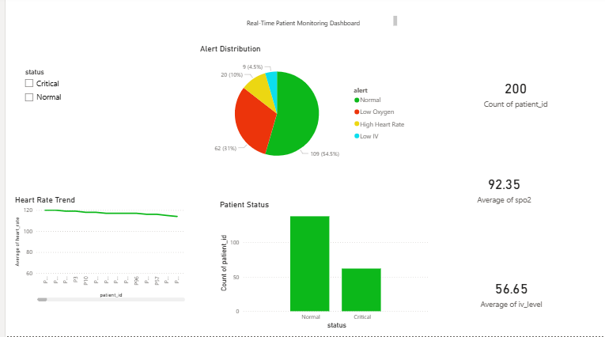

# 🏥 Hospital Patient Monitoring Analytics

## 📌 Project Overview

This project focuses on analyzing patient health data and monitoring hospital conditions using data analytics techniques.

## ⚙️ Tools & Technologies

* Python (Pandas, Matplotlib)
* Firebase (Realtime Database)
* Power BI

## 📊 Features

* Real-time data collection from IoT devices
* Data cleaning and preprocessing
* Patient status classification (Normal, Critical, No Data)
* Alert system for:

  * Low Oxygen
  * Low IV Level
  * No Signal
* Interactive Power BI dashboard

## 📈 Dashboard Insights

* Patient status distribution
* Alert analysis
* Heart rate trends
* Average SpO₂ and IV levels

## 🧠 Key Learnings

* Handling real-time and missing data
* Data visualization and storytelling
* Building end-to-end analytics projects

## 📷 Dashboard Preview

# hospital-patient-monitoring-analytics
